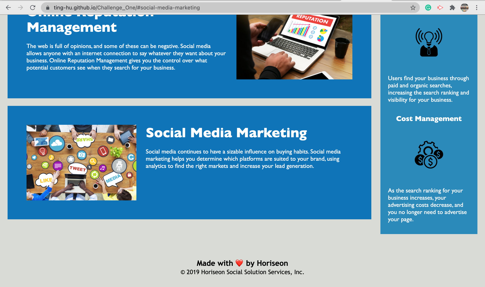
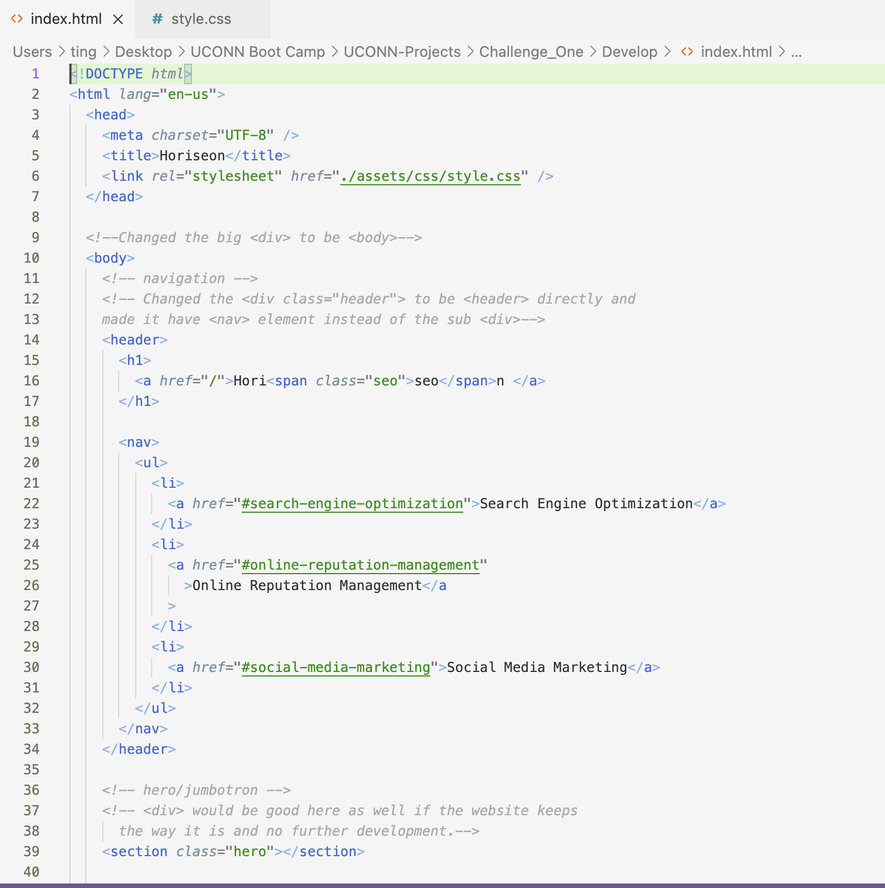
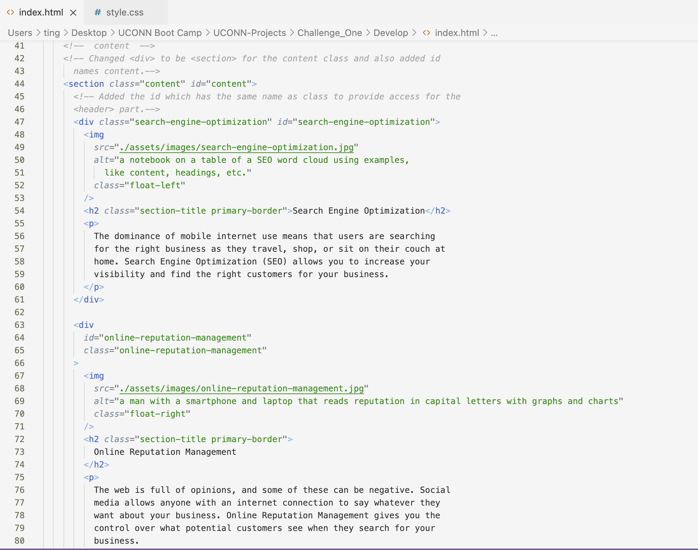
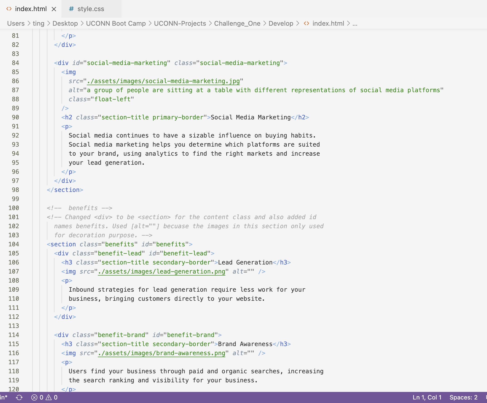
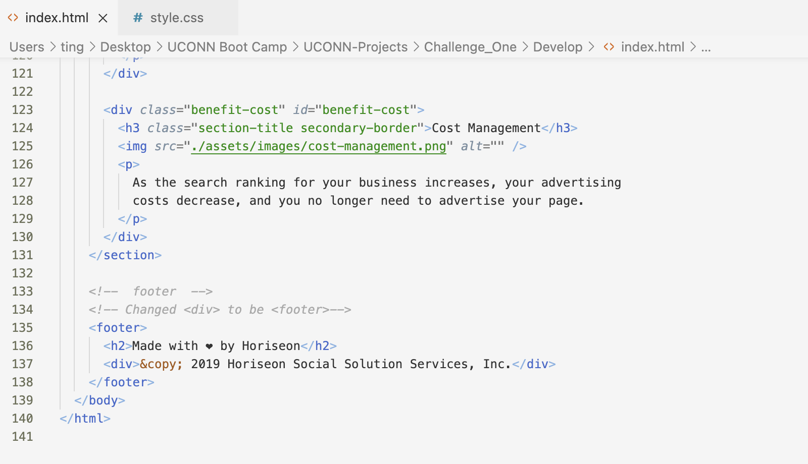
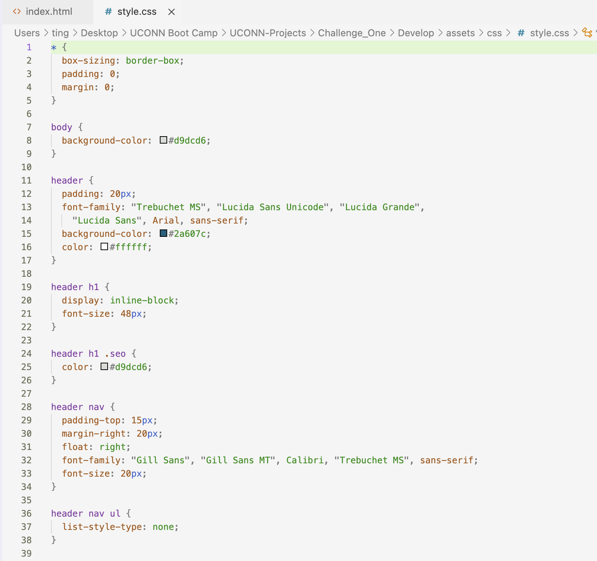
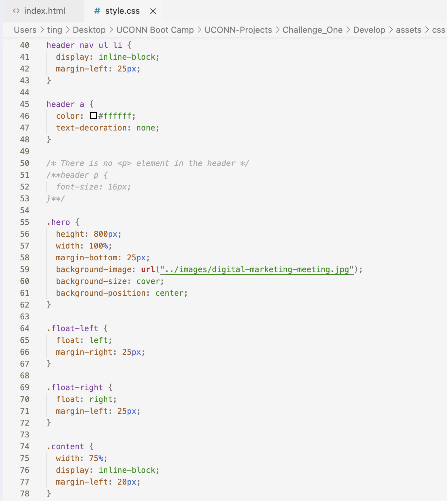
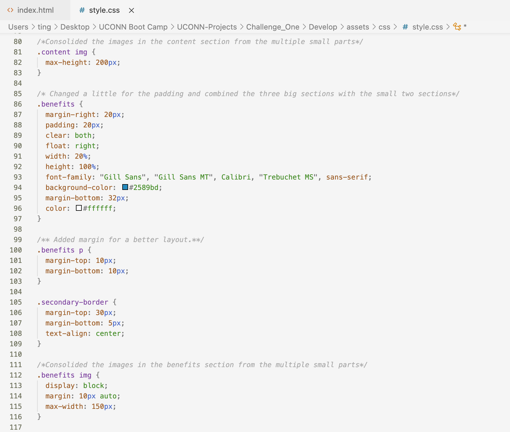
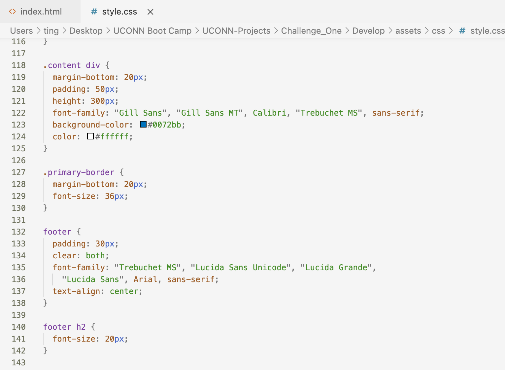

# Horiseon

## INFORMATION:

1. Develop folder is folder contains the [assets] folder.
2. [assets] folder contains the [css] folder, the [images] folder and the [screenshots] folder.
3. [css] folder contains the style.css for the index.html.
4. [images] folder contains the images for the index.html.
5. [screenshots] folder contains the screenshots of the refactored code and the sceenshots of the
   website for submission.

## Purpose

A refactored website for a better layout and easy read for the
developer.

## Built With

- HTML
- CSS

## Website

https://ting-hu.github.io/Challenge_One/

## Contribution

Refactored by Xueting Hu

## Screenshots

